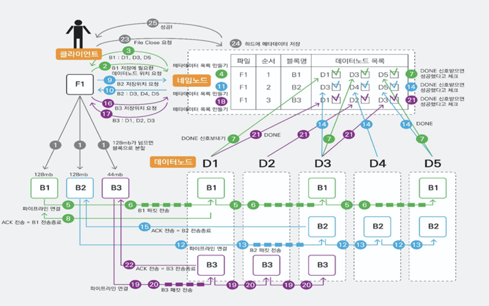

# Part 1: 하둡 개요

## **HDFS의 3대 노드와 작동**

### 3대 노드

- Client
- Namenode(네임노드): 데이터노드를 제어한다.
- Datanode(데이터노드): 데이터를 저장하는 노드, 제어하는 장치가 필요하다.(네임노드)

### HDFS 노드의 동작

- HDFS 클러스터는 master-worker 패턴으로 동작한다. master인 네임노드(filename, datanodename만을 가짐)와 worker인 데이터노드(data를 가짐)로 구성되어 있다.
- master가 일을 다 하게 되면 부하가 너무 master에게 쏠린다.
- 여러 개의 데이터노드에 저장하는 것은 데이터를 안전하게 저장하기 위해서이다.

## Namenode

### 네임노드와 메타데이터

- 파일시스템의 네임스페이스를 관리한다.
- 파일시스템 트리와 그 트리에 포함된 모든 파일과 디렉토리에 대한 메타데이터를 유지한다.
- 메타데이터는 namespace image와 edit log 두 종류의 파일로 로컬 디스크에 영속적으로 저장된다.
- 파일에 속한 모든 블록이 어떤 데이터노드에 있는지 파악하고 있다.
- 네임노드가 없으면 파일시스템은 동작하지 않으며, 어떤 파일도 찾을 수 없다.
- 데이터노드가 가지고 있는 블록 정보로는 파일을 재구성할 수 없다.

### 네임노드의 장애복구 메커니즘

1. 메타데이터를 지속적인 상태로 보존하기 위하여 파일로 백업한다.
    - 로컬 디스크와 원격의 NFS 마운트 두 곳에 동시에 백업
2. 보조 네임노드(secondary namenode)를 운영한다.
    - 네임스페이서의 이미지의 복제본을 보관하는 역할
    - 1 시간 정도의 시간차를 두고 보조 네임노드로 복제되기에 어느 정도의 데이터 손실은 불가피하다.

## 데이터 쓰는 프로세스

1. 유저로부터 request를 받는다.
2. 파일이 크기가 크다면, blocksize에 따라 여러 개의 block으로 쪼갠다.
    - 총 200mb짜리 파일이라면 128mb + 72mb로 저장
3. 네임노드에게 데이터노드 위치를 요청한다.
4. 네임노드는 저장할 데이터노드 위치를 전송하고 메타데이터 목록을 만든다.
    - Replication: 각 블록은 여러 곳에 분산 저장됨 (일반적으로 3개의 datanode에 저장)
5. client는 데이터노드에 block을 전송한다.
    - 데이터는 패킷(4k) 단위로 전송한다.
    - 3 개의 datanode에 각각 데이터를 전송하는 것이 아니다.
    - 첫 데이터노드는 데이터를 받고 있는 동안, 이미 받은 동일한 자료를 두 번째 데이터노드로 보낸다.
    - 같은 방식으로 두 번째 데이터노드는 세 번째 데이터노드에 자료를 보내고, 세 번째 데이터노드는 저장만 한다.
6. 각각의 데이터노드는 전송 완료 신호를 네임노드에 보내고, 네임노드는 메타데이터에 성공 체크를 한다.
7. 모든 데이터노드에 전송이 완료되면 ACK 패킷을 전송한다.
8. block의 개수만큼 3~7을 반복한다.
9. client는 네임노드에 file close를 요청한다.
10. 네임노드는 disk에 메타데이터를 저장한다.
    - disk에 저장하기 전에는 일단 memory에 저장한다.

## 데이터 읽는 프로세스

1. 유저로부터 request를 받는다.
2. client는 네임노드에게 파일에 대한 정보를 요청한다.
    - 파일에 대한 모든 블록의 목록
    - 각 블록의 데이터노드 목록 (client로부터 가까운 노드 순)
3. 데이터노드로부터 데이터 다운로드 (데이터를 읽을 때는 기록을 남기지 않는다.)

## HDFS 장애

### 장애 종류

1. 노드 오류
    - 서버가 죽은 상황.
    - 같은 데이터가 다른 노드에도 존재하기 때문에 복제하면 해결 가능
2. 통신 오류
    - 보통 일시적인 문제
    - 이 또한 다른 노드로부터 데이터를 받으면 해결 가능
3. 데이터 손상

### 장애 처리

1. Heartbeat
    - 데이터노드는 3초에 한번씩 HEARTBEAT를 네임노드에 보낸다.
    - 10분 동안 메세지를 받지 못하면 데이터노드가 죽었다고 판단한다.
2. Checksum
    - client가 데이터를 전송할 때, checksum을 함께 보낸다.
    - 데이터노드는 checksum을 함께 저장해둔다.
    - checksum은 해시함수를 사용하여 계산한다.
3. Block Report
    - Checksum이 맞는지 확인하고 Heartbeat에 얹어서 Block Report를 보낸다.
    - Heartbeat처럼 3초에 한 번씩 보내는 것은 아니다.
    - 모든 Checksum이 맞는지 확인하고 보낸다.
    - 정상인 것들의 Block Report만 보낸다.
4. 문제 있는 block 복제하기
    - 네임노드는 가지고 있는 block 목록과 데이터노드 목록을 바탕으로 복사할 곳의 데이터 위치를 데이터노드에게 전달한다.
5. 복제본 배치 전략
    - 첫 번째 복제소는 Client 데이터와 같은 렉의 노드를 선택한다. (없다면 랜덤 선택)
    - 두 번째와 세 번째 복제소는 다른 데이터노드를 선택 (두 번째와 세 번째는 가능하다면 같은 렉)